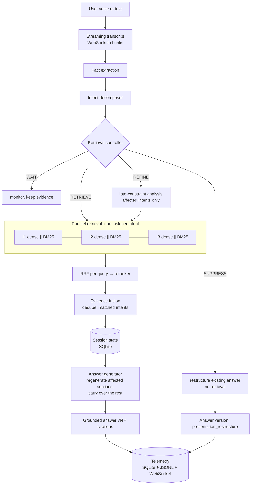
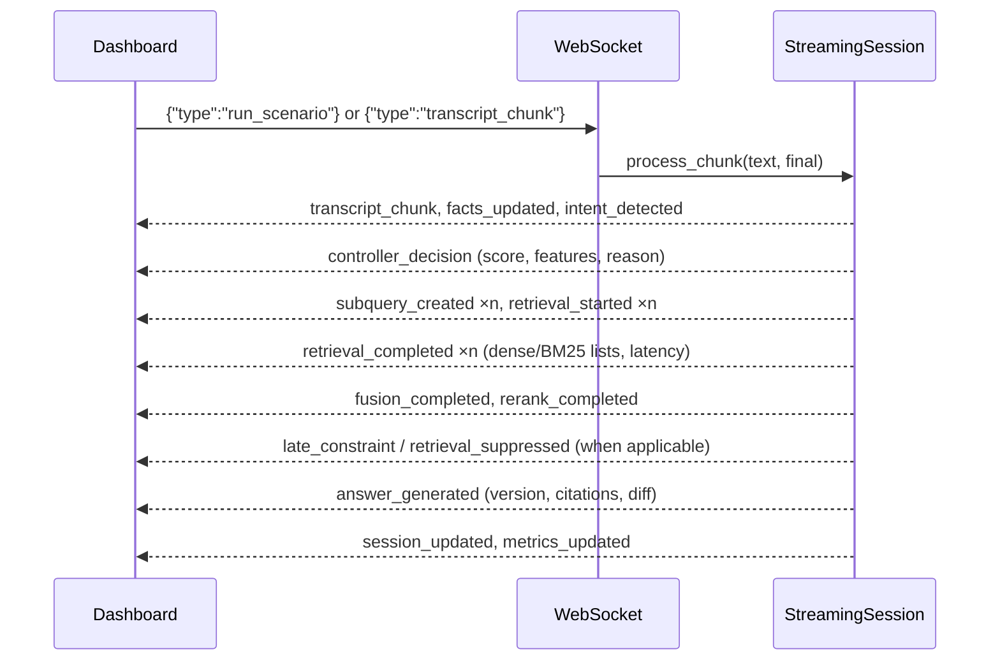

# Streaming Live RAG

Real-time incremental retrieval, multi-intent decomposition and state-preserving answer refinement, shown as an agent-assist system for telecom customer support.

The engine listens to a conversation chunk by chunk. For every chunk it decides whether to **WAIT**, **RETRIEVE**, **REFINE** or **SUPPRESS**. It retrieves before the customer finishes speaking once there is enough signal, splits compound requests into parallel sub-queries, keeps session state, re-retrieves only what a late correction affects, and skips retrieval entirely for requests that only change presentation. Every answer is grounded in a local corpus with chunk-level citations, and every step is recorded as a structured telemetry event that the dashboard renders live.

---

## 1. Problem

In a live support call, the question arrives in pieces:

> "My internet isn't working…" → "…the router has a red LOS light…" → "…my phone also can't connect…" → "…actually mobile data works, only Wi-Fi doesn't…" → "…will I get compensation for the outage?"

An assistant should have useful evidence on screen before the caller finishes. It should notice that there are four separate needs, and it should revise its answer when the caller corrects themselves. It should do all this without re-running the whole pipeline on every word.

## 2. Why traditional RAG is insufficient

```
complete query → retriever → top-k → LLM → answer
```

- **Late.** Nothing happens until the utterance is complete.
- **Single query.** "Red LOS light + Wi-Fi + compensation" becomes one blurred embedding that retrieves a little of everything and not enough of anything. In our benchmark the baseline answered only 44% of the gold intents; streaming answered 100%.
- **Stateless.** A late correction either gets ignored or forces a full restart.
- **Wasteful.** "Say that in three bullets" triggers a new vector search.

## 3. Solution

A **retrieval controller** scores each chunk with interpretable signals. A **decomposer** turns the running transcript into intents with focused sub-queries. **Hybrid retrieval** (dense + BM25 → RRF → reranker) runs per intent, in parallel. A **session state** holds facts, intents, evidence and answer versions. A **refinement engine** maps new facts to the answered intents that depend on them. The **answer generator** regenerates only affected sections and carries the rest over verbatim.

## 4. Architecture





The pipeline is split into real modules with no hidden `process_query()`. `app/runtime/streaming_engine.py` only sequences the stages; each stage lives in its own module (see §13).

## 5. Retrieval controller

`app/controller/retrieval_controller.py` evaluates every chunk against these weighted signals:

```
score = 0.30·semantic_stability + 0.25·intent_confidence + 0.20·entity_completeness
      + 0.15·information_gain   + 0.10·novelty
```

| signal | how it is computed |
|---|---|
| semantic stability | cosine similarity of transcript embeddings before and after the chunk (0 for the first chunk: no evidence yet) |
| intent confidence | strongest confidence among intents that would be retrieved |
| entity completeness | share of each intent's required slots that are filled (e.g. router signal for a light diagnosis) |
| information gain | 0.5 per new intent + 0.25 per changed fact, capped at 1 |
| novelty | 1 − max cosine similarity to queries already executed; near-duplicates (> `REDUNDANCY_THRESHOLD`) are dropped |

The rules are applied in order, and the first match wins:

1. A presentation-only request when an answer exists gives **SUPPRESS**.
2. A new or changed fact that an *answered* intent depends on gives **REFINE**. The reason is `late_constraint` if an earlier value was contradicted, otherwise `late_context`.
3. New or pending intents are scored:
   - score ≥ `RETRIEVAL_THRESHOLD` (0.70) gives **RETRIEVE**;
   - an end-of-turn chunk gives **RETRIEVE**;
   - a score in the monitor band (≥ 0.45) gives **WAIT** with the weakest signal named;
   - anything lower gives **WAIT**.
4. Anything else gives **WAIT**, reusing existing evidence.

All weights and thresholds are environment variables. For Scenario 1 the dashboard shows:

| t | chunk | decision | score |
|---|---|---|---|
| 0.0 | My internet isn't working. | WAIT (monitoring, stability 0) | 0.46 |
| 0.8 | The router has a red LOS light. | RETRIEVE, 2 intents in parallel | 0.81 |
| 1.6 | My phone also can't connect. | RETRIEVE, new Wi-Fi intent only | 0.97 |
| 2.4 | Actually mobile data works, only Wi-Fi doesn't. | REFINE `late_constraint` → I1, I3 | — |
| 3.2 | Also, will I get compensation for the outage? | RETRIEVE, compensation intent only | 0.82 |

## 6. Multi-intent decomposition

`app/intents/decomposer.py` is driven by a **domain pack** (`app/domains/telecom.json`): intents, weighted trigger patterns, required slots, fact dependencies and fact extractors. To re-target the engine to banking or IT support, you write a new JSON file; no code changes are needed.

The decomposer guards against over-fragmentation in three ways:
- Overlapping text spans are claimed by the strongest trigger only, so "compensation for the *outage*" does not also create a connectivity intent.
- Intents need a confidence of at least 0.5. Weaker ones are shown as tentative.
- Context-gated intents (e.g. *remote-work support*) require supporting facts. "I'm working from home" in a VPN conversation is recorded as a fact, not a new intent.

Each intent's sub-query is its base query plus terms from the facts it depends on. Terms can be intent-specific: a `wifi_only` scope adds "exclusions home wifi" to the compensation query, which surfaces the policy clause excluding Wi-Fi-only faults.

LLM decomposition is optional (`LLM_DECOMPOSITION=true`). LLM output is validated against the domain pack, and malformed JSON or unknown labels fall back to the deterministic result.

## 7. Hybrid retrieval

For every sub-query, `app/retrieval/hybrid.py` runs:

1. **Dense** (sentence-transformers `all-MiniLM-L6-v2` + FAISS `IndexFlatIP`) and **BM25** (`rank-bm25`) **concurrently** (`asyncio.to_thread`).
2. **Reciprocal Rank Fusion** (`k=60`).
3. **Re-ranking** with a CrossEncoder (`BAAI/bge-reranker-base`).

Sub-queries for different intents run concurrently via `asyncio.gather`, and each call's latency is recorded per stage. `fusion.fuse_evidence` then merges results across intents: a chunk found by several intents is kept once, and its `matched_intents` and per-intent ranks are preserved.

Chunks are indexed with a contextual header (document title + text). Chunking is paragraph-aware: long paragraphs are split on sentence boundaries and short neighbours are merged, giving 96 chunks from 57 documents.

**Graceful degradation.** Every heavy dependency has a fallback that is itself a working method, not a mock:

| missing | fallback |
|---|---|
| sentence-transformers / weights | LSA embedder: TF-IDF (uni+bigram) → truncated SVD, fitted on the corpus |
| faiss | exact numpy inner-product index |
| rank-bm25 | built-in Okapi BM25 (k1=1.5, b=0.75) |
| CrossEncoder | lexical reranker: IDF-weighted query-term coverage + normalised RRF |
| LLM | deterministic extractive answer generation |

`/health` and the dashboard header show which backend is active.

## 8. Session refinement

`SessionState` (`app/session/state.py`) holds:
- the conversation and facts, with a history of every change (old → new);
- the intent registry, with stable IDs, status (detected → retrieved → answered), query history and evidence;
- the unified evidence set, the answer versions, the executed queries and the decision log.

It is persisted to SQLite after every chunk and reloaded on demand, so a restarted backend can resume a session.

When "actually mobile data works, only Wi-Fi doesn't" arrives:
- `failure_scope` changes from `all_devices` to `wifi_only`, and `mobile_data_working` becomes `true`.
- The intents that depend on those facts (I1 connectivity, I3 Wi-Fi) are re-queried with updated sub-queries.
- I2 (the LOS light) is untouched. Its answer section is carried over verbatim and marked "kept from previous version".
- The `late_constraint` event records the invalidated assumption, the affected intents, and their old and new queries.

Each answer version records `version`, `timestamp`, `trigger`, `affected_intents`, `citations` and a diff: added and removed claims, plus regenerated and carried-over sections.

## 9. Retrieval suppression

A request like "Summarize the previous answer", "Give that in 3 bullets", "Make it shorter" or "Explain the same answer more simply" matches a presentation pattern but contains no new intent and no new fact, so it gives **SUPPRESS**. No dense search, no BM25 and no reranker run. The previous grounded claims are restructured, and their citations are kept as a subset. The dashboard shows **RETRIEVAL SUPPRESSED — Reason: presentation_restructure** and the telemetry records `retrieval_calls: 0`. A request that mixes reformatting with a new topic ("summarize and tell me about billing") is *not* suppressed.

## 10. Grounding and citations

- **Deterministic mode.** Claims are sentences extracted from retrieved chunks, so each claim is verbatim corpus text. A test asserts that `claim in chunk.text`. A sentence must match the intent's core terms, not only context terms, to be used.
- **LLM mode.** The model returns claims with `chunk_ids`. Every ID is validated against the evidence supplied for that intent, and claims without a valid citation are dropped and reported.
- **Uncertainty.** If the best evidence covers less than `GROUNDING_MIN_COVERAGE` of the intent's query terms, the section says the knowledge base lacks enough evidence instead of answering. "Can you recommend a good pizza place?" produces an uncertainty and zero citations.
- **Inspection.** Citations are clickable: a drawer opens the source document with the cited chunk highlighted.

## 11. Telemetry

Every stage emits a structured event, `{event_id, session_id, timestamp, type, payload}`, where the timestamp is in seconds since the session started. The event types are: `session_created`, `transcript_chunk`, `facts_updated`, `intent_detected`, `controller_decision`, `subquery_created`, `retrieval_started`, `retrieval_completed`, `fusion_completed`, `rerank_completed`, `late_constraint`, `session_updated`, `answer_generated`, `retrieval_suppressed`, `metrics_updated` and `error`.

Events are written three ways:
- to SQLite (`events` table);
- to `data/telemetry/<session>.jsonl` as a backup;
- over the WebSocket, which the dashboard consumes without polling.

Session metrics (`app/telemetry/metrics.py`) are computed only from these events. They include retrieval calls, unnecessary retrievals, first-retrieval latency, per-call latency breakdown, decision counts, answer versions and citation coverage. A retrieval counts as *unnecessary* when less than 20% of its results are new to the session.

## 12. Benchmark methodology

`python scripts/run_benchmark.py` writes `results.json`, one CSV per experiment and `results.md` to `data/benchmark/`. The dashboard's **Benchmark** tab shows the same data and can rerun it.

**Timing model.** Scenarios replay on a *virtual clock*. Each chunk arrives at its scripted speech time, and processing advances the clock by the real measured compute time; nothing sleeps. The latencies therefore combine speech timing with real compute and are comparable across modes.

**Scenarios.** There are 7: the 3 demo scenarios, plus single-intent, slow-speed + upgrade, remote-worker outage, and out-of-corpus. Gold labels (intents, relevant documents, expected decisions) are used only by the evaluator. There is also a 28-query retrieval set.

| experiment | compares |
|---|---|
| E1 | baseline RAG (wait, one query) vs streaming |
| E2 | dense-only vs BM25-only vs hybrid. `retriever_*` = fused ranking before reranking; `reranked_*` = final |
| E3 | full restart on new context vs targeted refinement |
| E4 | retrieval on every chunk vs controller-based retrieval |

**Results from our development run.** These used the **fallback stack**: LSA embedder, lexical reranker, extractive generator. Means are across the 7 scenarios.

| | baseline | streaming |
|---|---|---|
| first retrieval latency | 1.92 s | **0.77 s** |
| gold intents answered (cited a gold doc) | 0.44 | **1.00** |
| gold evidence recall | 0.79 | **1.00** |
| retrieval calls / scenario | 1 | 2.86 |
| unnecessary retrievals / scenario | 0 | 0.14 |

| | targeted refinement | full restart |
|---|---|---|
| retrieval calls | **6** | 8 |
| unnecessary retrievals | **0.5** | 2.5 |
| answer sections carried over | 2 | 0 |

| | controller | every chunk |
|---|---|---|
| retrieval calls | **2.86** | 5.86 |
| unnecessary retrievals | **0.14** | 3.0 |
| first retrieval latency | 0.77 s | 0.002 s |

For E2 (retriever stage), hybrid scored the best MRR@5: 0.774 against 0.751 for dense and 0.753 for BM25. It also scored the best recall@3: 0.80 against 0.79 and 0.77.

**Read these numbers honestly:**
- **Intent F1 and decision accuracy are in-distribution.** Both reached 1.0, but the gold labels and the domain-pack patterns were written by the same author, so this shows the pipeline behaves as designed on its scenarios, not that it generalises. The latency, call-count and ablation deltas are the more meaningful results.
- **The dense vs BM25 gap is small** because the LSA fallback is itself lexical. Rerun inside Docker with MiniLM + CrossEncoder to measure real semantic gains.
- **The lexical fallback reranker slightly lowered recall@3.** Treat it as a degradation path, not an improvement.
- **The every-chunk mode retrieves sooner**, 0.002 s versus 0.77 s, but at double the calls with mostly redundant results. That trade-off is exactly what the controller exists to manage.

## 13. Project structure

```
streaming-rag/
├── backend/
│   ├── app/
│   │   ├── main.py                    FastAPI app (lifespan builds services once)
│   │   ├── config.py                  all tunables, env-overridable
│   │   ├── api/                       routes.py, websocket.py, schemas.py (Pydantic),
│   │   │                              service.py (endpoint logic), ws_protocol.py
│   │   ├── controller/                retrieval_controller.py, decision_engine.py, stability.py
│   │   ├── intents/                   decomposer.py, intent_models.py
│   │   ├── domains/telecom.json       domain pack (intents, facts, triggers)
│   │   ├── retrieval/                 indexer.py (load/chunk/build), dense.py, bm25.py,
│   │   │                              fusion.py, reranker.py, hybrid.py, text.py
│   │   ├── session/                   state.py, manager.py, refinement.py
│   │   ├── generation/                provider.py, prompts.py, answer_generator.py
│   │   ├── telemetry/                 events.py (+clocks), logger.py (bus), metrics.py
│   │   ├── runtime/                   streaming_engine.py, registry.py, services.py
│   │   ├── benchmark/                 scenarios.py, baseline.py, evaluator.py
│   │   └── db/                        database.py (sqlite3), models.py (schema)
│   ├── corpus/raw/*.json              57 synthetic support documents
│   ├── scripts/                       build_index.py, seed_corpus.py, run_benchmark.py,
│   │                                  dev_server_stdlib.py
│   ├── tests/                         13 test modules
│   ├── requirements.txt, Dockerfile, pytest.ini
├── frontend/
│   ├── src/
│   │   ├── App.tsx, main.tsx, index.css
│   │   ├── pages/                     Dashboard.tsx, Benchmark.tsx
│   │   ├── components/                DecisionRail, TranscriptPanel, ControllerPanel,
│   │   │                              IntentPanel, RetrievalPanel, MetricsPanel, Charts,
│   │   │                              AnswerPanel, EvidencePanel, CitationDrawer, TelemetryLog, Header
│   │   ├── hooks/                     useSession.ts (WebSocket), derive.ts (events → view)
│   │   ├── services/api.ts, types/events.ts
│   ├── package.json, vite.config.ts, Dockerfile
├── data/ (sessions/, telemetry/, benchmark/)   runtime output, mounted into Docker
├── docs/benchmark-sample/             results from our development run
├── docker-compose.yml, .env.example, README.md
```

## 14. Setup

Requirements:
- **Docker path:** Docker with Compose v2.
- **Local path:** Python 3.11+ and Node 20+.

The first Docker build downloads CPU PyTorch and the model weights (about 1.5 GB with `bge-reranker-base`). For a lighter build, set `RERANKER_MODEL=cross-encoder/ms-marco-MiniLM-L-6-v2` in `.env`.

```bash
cp .env.example .env        # optional; defaults work without it
```

## 15. Running locally

```bash
# backend
cd backend
python -m venv .venv && source .venv/bin/activate
pip install -r requirements.txt
python scripts/seed_corpus.py          # validate corpus + stats
python scripts/build_index.py          # chunks + FAISS + BM25 → corpus/processed/
uvicorn app.main:app --reload --port 8000

# frontend (second terminal)
cd frontend
npm install
npm run dev                            # http://localhost:5173
```

The backend builds the index automatically if it is missing or the corpus changed. With no network or no FastAPI (e.g. an air-gapped laptop), `python scripts/dev_server_stdlib.py --port 8000` serves the same API and WebSocket protocol using only the standard library and numpy.

## 16. Running with Docker

```bash
docker compose up --build
```

| service | URL |
|---|---|
| frontend | http://localhost:5173 |
| backend | http://localhost:8000 |
| Swagger | http://localhost:8000/docs |

The index is built during the image build. `./data` is mounted for sessions, telemetry and benchmark output. To use a local Ollama, set `LLM_PROVIDER=ollama` in `.env`; `host.docker.internal` is mapped on Linux too.

## 17. Running the demo scenarios

1. Open http://localhost:5173 and leave **Demo mode** on.
2. Pick a scenario:
   - **Scenario 1 — Outage + Wi-Fi + Compensation:** WAIT → early RETRIEVE (2 intents in parallel) → new-intent RETRIEVE → REFINE → targeted RETRIEVE; four answer versions.
   - **Scenario 2 — VPN + Authentication + Finance Access:** early retrieval at chunk 2, three intents, REFINE on "working from home" (late context) and on "finance dashboard" (late constraint).
   - **Scenario 3 — Query Suppression:** RETRIEVE, then **RETRIEVAL SUPPRESSED, Reason: presentation_restructure**.
3. Click **Start Live Conversation**. Chunks stream at their scripted times (0.5–2× speed) through the same WebSocket path as live input.
4. Hover a transcript chunk to highlight it on the decision rail, click any citation chip to open its source, and switch answer versions to see what changed.

For live input, turn Demo mode off, click **New live session** and type chunks. Tick **End of turn** to tell the controller the utterance is complete. In Chromium browsers, **Mic** sends each finalised speech segment as a chunk (optional; not needed for the demo).

REST alternative:

```bash
SID=$(curl -s -X POST localhost:8000/api/session | jq -r .session_id)
curl -s -X POST localhost:8000/api/session/$SID/message -H 'content-type: application/json' \
     -d '{"text":"The router has a red LOS light.","final":true}' | jq .decision.decision
curl -s localhost:8000/api/session/$SID/metrics | jq
```

## 18. Running benchmarks and tests

```bash
cd backend
python scripts/run_benchmark.py     # → data/benchmark/{results.json,results.md,*.csv}
pytest -q                           # all modules, including FastAPI + WebSocket tests
# in Docker:
docker compose exec backend python scripts/run_benchmark.py
docker compose exec backend pytest -q
```

## 19. Environment variables

| variable | default | purpose |
|---|---|---|
| `LLM_PROVIDER` | `fallback` | `ollama`, `openai` (any OpenAI-compatible URL) or `fallback` |
| `OLLAMA_BASE_URL`, `OLLAMA_MODEL` | `http://localhost:11434`, `llama3.1:8b` | Ollama |
| `OPENAI_API_KEY`, `OPENAI_BASE_URL`, `OPENAI_MODEL` | –, OpenAI, `gpt-4o-mini` | OpenAI-compatible |
| `LLM_DECOMPOSITION` | `false` | let the LLM propose intents |
| `EMBEDDING_BACKEND`, `EMBEDDING_MODEL` | `auto`, `all-MiniLM-L6-v2` | `auto` falls back to LSA |
| `RERANKER_BACKEND`, `RERANKER_MODEL` | `auto`, `BAAI/bge-reranker-base` | `lexical` / `none` for ablations |
| `RETRIEVAL_MODE` | `hybrid` | `dense`, `bm25`, `hybrid` |
| `RETRIEVAL_THRESHOLD`, `MONITOR_THRESHOLD` | `0.70`, `0.45` | controller bands |
| `REDUNDANCY_THRESHOLD` | `0.92` | drop near-duplicate sub-queries |
| `CONTROLLER_MODE` | `adaptive` | `every_chunk` for ablation |
| `REFINEMENT_MODE` | `targeted` | `restart` for ablation |
| `TOP_K_PER_RETRIEVER`, `TOP_K_FINAL`, `RRF_K` | `8`, `5`, `60` | retrieval depth |
| `GROUNDING_MIN_COVERAGE` | `0.34` | below this, an intent is reported as unsupported |
| `DATA_DIR` | `./data` | SQLite, telemetry, benchmark output |
| `VITE_API_URL` | `http://localhost:8000` | backend URL as seen by the browser |

## 20. Future extensions

- **Learned controller:** fit the weights and thresholds on logged sessions (the telemetry already holds features and outcomes).
- **Streaming ASR:** partial hypotheses with word-level stability instead of finalised chunks.
- **More domain packs:** banking, insurance, e-commerce. The engine needs no change, only a new JSON file and corpus.
- **Conflict detection:** flag chunks from different document versions that disagree.
- **LLM-based semantic suppression and refinement detection:** complement the pattern rules.
- **Postgres + pgvector** for multi-tenant deployment. SQLite is the default for zero-setup.

## Known limitations

- **Pattern-based understanding.** Intent and fact extraction are pattern-based by default. That makes behaviour reproducible and inspectable, but phrasing outside the domain pack's patterns may be missed. That is what the optional LLM decomposition is for.
- **Readability of extractive answers.** Deterministic answers are extractive: they are exact and cited, but read like the corpus (partly agent-facing instructions). An LLM provider produces fluent answers, and its citations are validated.
- **Corpus scale.** The corpus is synthetic and small (57 documents). Retrieval metrics saturate quickly; a larger corpus would separate the retrieval modes more clearly.
- **Persistence layer.** Sessions use `sqlite3` from the standard library rather than SQLAlchemy/SQLModel. The schema is three tables, and this keeps the prototype dependency-free.
- **Verification environment.** The prototype was developed in an offline sandbox without FastAPI, PyTorch or npm registry access:
  - Core engine, retrieval, benchmark and WebSocket protocol: tested there (36 tests).
  - Frontend: type-checked against a React type shim, bundled with esbuild, and driven in headless Chromium against the live engine through the stdlib server.
  - FastAPI routes, the Tailwind build and the Docker images: written against their documented APIs but first executed on a machine with network access. Run `pytest` and `docker compose up --build` there first.
